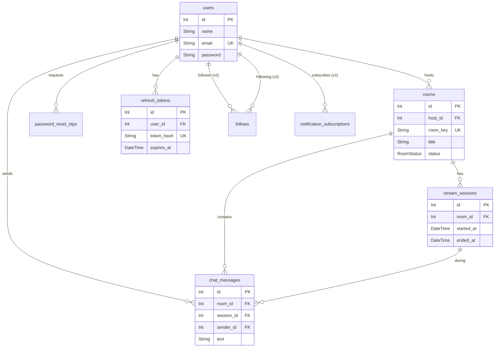

# StreamForge — Database Schema Planning

> Single-Host Live Streaming Platform | Prisma ORM + PostgreSQL (Neon) | v1.0 | May 2026

---

## Entity Relationship Overview

---

## Enums

### `RoomStatus`

| Value     | Description                            |
| --------- | -------------------------------------- |
| `OFFLINE` | Room created but host is not streaming |
| `LIVE`    | Host is actively broadcasting          |
| `ENDED`   | Stream session has concluded           |

---

## 1 users

> Source: Journey 01 (Registration), Journey 02 (Login), Journey 11 (Guest — no DB record)
> DFD: Authentication → Host Registration, Host Login

| Column              | Type      | Null | Default | Notes                          |
| ------------------- | --------- | ---- | ------- | ------------------------------ |
| `id`                | int       | no   | AI      | PK                             |
| `name`              | string    | no   |         |                                |
| `email`             | string    | no   |         | UK (unique, global)            |
| `password`          | string    | no   |         | bcryptjs hash                  |
| `avatar_url`        | string    | yes  |         | Shown when camera off          |
| `is_active`         | boolean   | no   | `true`  |                                |
| `email_verified_at` | timestamp | yes  |         |                                |
| `created_at`        | timestamp | no   | `now()` |                                |
| `updated_at`        | timestamp | no   | `now()` | `@updatedAt`                   |

**Indexes:**
- `UK_users_email` — unique index on `email`

---

## 2 password_reset_otps

> Source: Journey 03 (Password Recovery — Steps 06–12)
> DFD: Authentication → Password Recovery, Send OTP Email, Password Reset

| Column       | Type      | Null | Default | Notes                                |
| ------------ | --------- | ---- | ------- | ------------------------------------ |
| `id`         | int       | no   | AI      | PK                                   |
| `user_id`    | int       | no   |         | FK → `users.id`, ON DELETE CASCADE   |
| `otp_hash`   | string    | no   |         | Hashed 6-digit OTP                   |
| `expires_at` | timestamp | no   |         | 10-minute window from creation       |
| `created_at` | timestamp | no   | `now()` |                                      |

> **Note:** OTPs are hard-deleted after successful verification rather than soft-flagged. This eliminates stale data and simplifies queries.

**Indexes:**
- `IDX_password_reset_otps_user_id` — index on `user_id`
- `IDX_password_reset_otps_expires_at` — index on `expires_at` (for cleanup queries)

---

## 2.5 refresh_tokens

> Source: Authentication — Token rotation, session management, logout from all devices
> Rationale: Refresh tokens are SHA256-hashed before storage. Token rotation deletes the old token and creates a new one on each refresh. A maximum of 5 active tokens per user prevents database accumulation.

| Column       | Type      | Null | Default | Notes                                       |
| ------------ | --------- | ---- | ------- | ------------------------------------------- |
| `id`         | int       | no   | AI      | PK                                          |
| `user_id`    | int       | no   |         | FK → `users.id`, ON DELETE CASCADE          |
| `token_hash` | string    | no   |         | UK (unique), SHA256 hash of raw token       |
| `expires_at` | timestamp | no   |         | 7-day window from creation                  |
| `created_at` | timestamp | no   | `now()` |                                             |

**Indexes:**
- `UK_refresh_tokens_token_hash` — unique index on `token_hash` (lookup on refresh)
- `IDX_refresh_tokens_user_id` — index on `user_id` (logout-all, session count)

---

## 3 rooms

> Source: Journey 04 (Create Room), Journey 05 (Go Live), Journey 10 (End Stream), Journey 12 (Dashboard)
> DFD: Streaming Core → Create Room, Generate Room URL | Host Dashboard → Room Management

| Column                | Type      | Null | Default   | Notes                                       |
| --------------------- | --------- | ---- | --------- | ------------------------------------------- |
| `id`                  | int       | no   | AI        | PK                                          |
| `host_id`             | int       | no   |           | FK → `users.id`, ON DELETE CASCADE          |
| `room_key`            | string    | no   |           | UK (unique), nanoid slug for shareable URL   |
| `title`               | string    | no   |           | Required on creation                         |
| `description`         | text      | yes  |           |                                              |
| `thumbnail_url`       | string    | yes  |           | Max 2 MB image                               |
| `status`              | enum      | no   | `OFFLINE` | `OFFLINE`, `LIVE`, `ENDED`                   |
| `slow_mode_interval`  | int       | yes  |           | `null` = disabled; `10`, `30`, or `60` secs  |
| `guest_chat_enabled`  | boolean   | no   | `true`    | Host can disable guest chat                  |
| `created_at`          | timestamp | no   | `now()`   |                                              |
| `updated_at`          | timestamp | no   | `now()`   | `@updatedAt`                                 |

**Indexes:**
- `UK_rooms_room_key` — unique index on `room_key`
- `IDX_rooms_host_id` — index on `host_id` (dashboard queries: `GET /api/rooms/mine`)
- `IDX_rooms_status` — index on `status` (filter by live/offline/ended)

---

## 4 stream_sessions

> Source: Journey 05 (Go Live — Step 10), Journey 10 (End Stream — Steps 05, 10–11)
> DFD: Host Dashboard → Post-Stream Summary → PostgreSQL Database
> Rationale: A room is reusable. Each "Go Live → End Stream" cycle creates one session record.

| Column               | Type      | Null | Default | Notes                                        |
| -------------------- | --------- | ---- | ------- | -------------------------------------------- |
| `id`                 | int       | no   | AI      | PK                                           |
| `room_id`            | int       | no   |         | FK → `rooms.id`, ON DELETE CASCADE           |
| `started_at`         | timestamp | no   | `now()` | Set when host clicks "Go Live"               |
| `ended_at`           | timestamp | yes  |         | Set when host clicks "End Stream"            |
| `duration_seconds`   | int       | yes  |         | Computed on end: `ended_at - started_at`     |
| `peak_viewer_count`  | int       | no   | `0`     | Updated in real time via Socket.io server    |
| `total_chat_messages`| int       | no   | `0`     | Incremented per message during session       |
| `created_at`         | timestamp | no   | `now()` |                                              |

**Indexes:**
- `IDX_stream_sessions_room_id` — index on `room_id` (stream history list)
- `IDX_stream_sessions_started_at` — index on `started_at` (order by recent)

---

## 5 chat_messages

> Source: Journey 08 (Live Chat — Steps 01–15)
> DFD: Real-time Events → Live Chat Messages, Chat Moderation → PostgreSQL Database

| Column        | Type        | Null | Default | Notes                                          |
| ------------- | ----------- | ---- | ------- | ---------------------------------------------- |
| `id`          | int         | no   | AI      | PK                                             |
| `room_id`     | int         | no   |         | FK → `rooms.id`, ON DELETE CASCADE             |
| `session_id`  | int         | no   |         | FK → `stream_sessions.id`, ON DELETE CASCADE   |
| `sender_id`   | int         | yes  |         | FK → `users.id`, ON DELETE SET NULL; `null` = guest |
| `sender_name` | string      | no   |         | Display name (registered user name or guest nickname) |
| `text`        | varchar(300)| no   |         | Capped at 300 characters, XSS-sanitized       |
| `is_pinned`   | boolean     | no   | `false` | Only one pinned message per room at a time     |
| `is_deleted`  | boolean     | no   | `false` | Soft delete — host moderation action           |
| `created_at`  | timestamp   | no   | `now()` |                                                |

**Indexes:**
- `IDX_chat_messages_room_id_session_id` — composite index on `(room_id, session_id)` (load chat history)
- `IDX_chat_messages_room_id_is_pinned` — composite index on `(room_id, is_pinned)` (find pinned message)
- `IDX_chat_messages_sender_id` — index on `sender_id`

---

## 6 follows (v2)

> Source: MVP vs Future table — "Viewer follow / notification subscription" marked v2
> DFD: Not in v1 DFD — future extension

| Column        | Type      | Null | Default | Notes                                    |
| ------------- | --------- | ---- | ------- | ---------------------------------------- |
| `id`          | int       | no   | AI      | PK                                       |
| `follower_id` | int       | no   |         | FK → `users.id`, ON DELETE CASCADE       |
| `host_id`     | int       | no   |         | FK → `users.id`, ON DELETE CASCADE       |
| `created_at`  | timestamp | no   | `now()` |                                          |

**Indexes:**
- `UK_follows_follower_host` — unique composite on `(follower_id, host_id)` (prevent duplicate follows)
- `IDX_follows_host_id` — index on `host_id` (count followers)

**Constraints:**
- `CHECK (follower_id != host_id)` — user cannot follow themselves

---

## 7 notification_subscriptions (v2)

> Source: Features — "Browser push notification support (opt-in with permission)"
> DFD: Not in v1 DFD — future extension

| Column       | Type      | Null | Default | Notes                                    |
| ------------ | --------- | ---- | ------- | ---------------------------------------- |
| `id`         | int       | no   | AI      | PK                                       |
| `user_id`    | int       | no   |         | FK → `users.id`, ON DELETE CASCADE       |
| `endpoint`   | text      | no   |         | Web Push API endpoint URL                |
| `p256dh_key` | string    | no   |         | Public key for push encryption           |
| `auth_key`   | string    | no   |         | Auth secret for push encryption          |
| `is_active`  | boolean   | no   | `true`  |                                          |
| `created_at` | timestamp | no   | `now()` |                                          |

**Indexes:**
- `UK_notification_subscriptions_endpoint` — unique index on `endpoint`
- `IDX_notification_subscriptions_user_id` — index on `user_id`

---

## Data NOT Stored in PostgreSQL

These features are handled in-memory or via transient real-time events and do **not** require database tables:

| Feature              | Handled By    | Reason                                                        |
| -------------------- | ------------- | ------------------------------------------------------------- |
| Live viewer count    | Socket.io     | Real-time counter; `peak_viewer_count` saved in `stream_sessions` on change |
| Emoji reactions      | Socket.io     | Transient floating animations; no persistence needed for MVP  |
| WebRTC media streams | LiveKit SFU   | Media routed through LiveKit server, not stored in DB         |
| Rate limiting state  | In-memory / Redis | Per-user counters for chat (3/5s) and reactions (1/2s)    |
| Guest viewer identity| Client-side   | `guest_<nanoid>` generated on frontend; lost on page refresh  |

---

## FK Reference Cross-Check

> Ensures every FK column type matches its referenced PK type with no mismatches.

| FK Column                           | Type | References         | Type | Match |
| ----------------------------------- | ---- | ------------------ | ---- | ----- |
| `password_reset_otps.user_id`       | int  | `users.id`         | int  | ✅    |
| `refresh_tokens.user_id`            | int  | `users.id`         | int  | ✅    |
| `rooms.host_id`                     | int  | `users.id`         | int  | ✅    |
| `stream_sessions.room_id`           | int  | `rooms.id`         | int  | ✅    |
| `chat_messages.room_id`             | int  | `rooms.id`         | int  | ✅    |
| `chat_messages.session_id`          | int  | `stream_sessions.id`| int | ✅    |
| `chat_messages.sender_id`           | int  | `users.id`         | int  | ✅    |
| `follows.follower_id` (v2)          | int  | `users.id`         | int  | ✅    |
| `follows.host_id` (v2)              | int  | `users.id`         | int  | ✅    |
| `notification_subscriptions.user_id` (v2) | int | `users.id`   | int  | ✅    |

---

## Feature ↔ Table Traceability Matrix

> Maps every data-touching feature back to the table that stores it.

| Feature Requirement                          | Table(s)                          | Version |
| -------------------------------------------- | --------------------------------- | ------- |
| Host registration (name, email, password)    | `users`                           | MVP     |
| JWT authentication & login                   | `users` (query by email)          | MVP     |
| Refresh token session management             | `refresh_tokens`                  | MVP     |
| Logout / logout from all devices             | `refresh_tokens` (delete by user) | MVP     |
| Forgot password with OTP                     | `password_reset_otps`             | MVP     |
| Create stream room (title, desc, thumbnail)  | `rooms`                           | MVP     |
| Unique shareable URL per room                | `rooms.room_key`                  | MVP     |
| Room status (Offline / Live / Ended)         | `rooms.status`                    | MVP     |
| Host goes live / ends stream                 | `rooms.status` + `stream_sessions`| MVP     |
| Host slow mode & guest chat toggle           | `rooms.slow_mode_interval`, `rooms.guest_chat_enabled` | MVP |
| Post-stream summary (duration, peak, msgs)   | `stream_sessions`                 | MVP     |
| Stream history list                          | `stream_sessions` (by room)       | MVP     |
| Real-time chat messages                      | `chat_messages`                   | MVP     |
| Pin / unpin message                          | `chat_messages.is_pinned`         | MVP     |
| Delete message (moderation)                  | `chat_messages.is_deleted`        | MVP     |
| Guest viewer display name in chat            | `chat_messages.sender_name`       | MVP     |
| Viewer follow / subscription                 | `follows`                         | v2      |
| Browser push notifications                   | `notification_subscriptions`      | v2      |

---

## Cascade Delete Strategy

| Parent Deleted       | Child Table              | Action         | Reason                                          |
| -------------------- | ------------------------ | -------------- | ----------------------------------------------- |
| `users` deleted      | `password_reset_otps`    | CASCADE        | OTPs are useless without the user               |
| `users` deleted      | `refresh_tokens`         | CASCADE        | Sessions are useless without the user            |
| `users` deleted      | `rooms`                  | CASCADE        | Host's rooms removed with account               |
| `users` deleted      | `chat_messages.sender_id`| SET NULL       | Preserve chat history, show as "[deleted user]"  |
| `rooms` deleted      | `stream_sessions`        | CASCADE        | Session data belongs to the room                 |
| `rooms` deleted      | `chat_messages`          | CASCADE        | Chat belongs to the room                         |
| `stream_sessions` deleted | `chat_messages`       | CASCADE        | Messages are scoped to a session                 |

---

## Prisma Type Mapping Reference

| Schema Doc Type | Prisma Type          | PostgreSQL Type         | Notes                          |
| --------------- | -------------------- | ----------------------- | ------------------------------ |
| `int` (PK)      | `Int`                | `SERIAL`                | `@id @default(autoincrement())`|
| `string`        | `String`             | `TEXT`                  |                                |
| `varchar(300)`  | `String`             | `VARCHAR(300)`          | `@db.VarChar(300)`             |
| `text`          | `String`             | `TEXT`                  | `@db.Text`                     |
| `boolean`       | `Boolean`            | `BOOLEAN`               |                                |
| `int`           | `Int`                | `INTEGER`               |                                |
| `timestamp`     | `DateTime`           | `TIMESTAMP(3)`          | `@default(now())`              |
| `enum`          | Prisma `enum`        | PostgreSQL `ENUM`       | Defined at schema level        |
