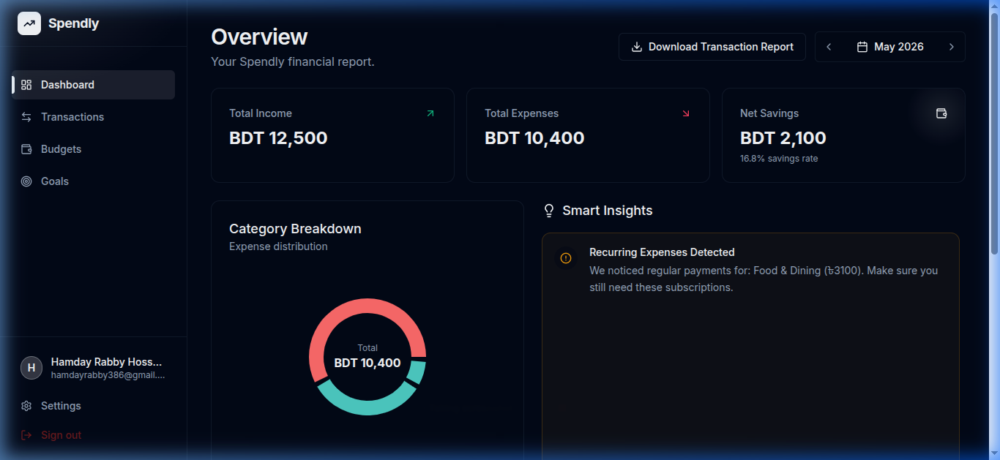
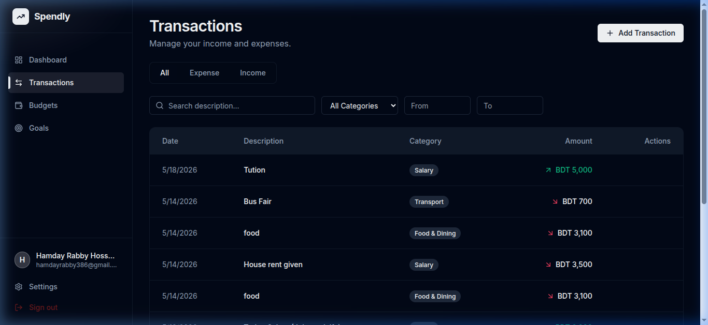
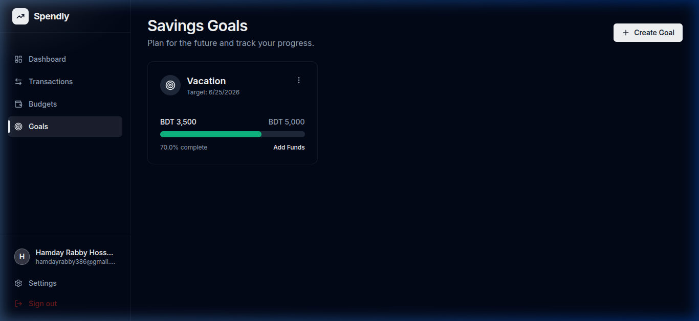
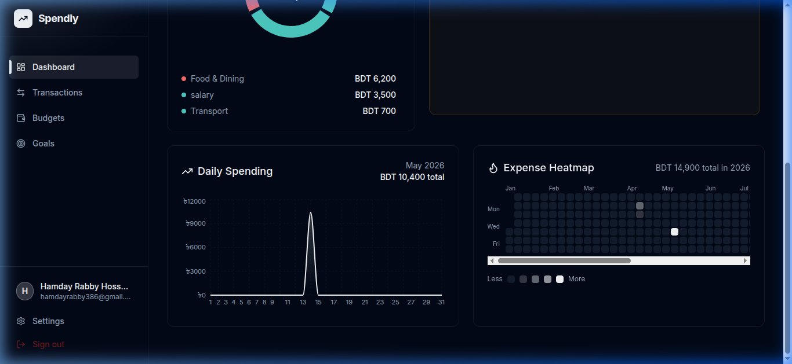

# 💰 Spendly — Personal Finance Dashboard

**Submitted by:** Hamdayrabby  
**GitHub:** [@Hamdayrabby](https://github.com/Hamdayrabby)  
**Repository:** [github.com/Hamdayrabby/spendly](https://github.com/Hamdayrabby/spendly)  
**Live Demo:** [spendly-production.up.railway.app](https://spendly-production.up.railway.app)

---

## 📌 Project Summary

Spendly is a **full-stack MERN personal finance dashboard** that lets users track transactions, manage budgets, set savings goals, and analyze spending behavior — all from a single, polished interface.

This is not a template or tutorial clone — it was built from scratch with production-grade architecture, covering real concerns like **JWT token refresh queuing**, **MongoDB aggregation pipelines**, **rate limiting**, and **responsive dark-mode UI**.

---

## 🖼️ Screenshots

### Landing Page


### Login Page


### Dashboard Overview


### Transaction Management


### Budget Tracking


### Savings Goals


### Analytics & Heatmap


---

## ⚙️ Tech Stack

| Layer | Technology |
|-------|-----------|
| **Frontend** | React 19, Vite, TailwindCSS, Framer Motion |
| **State Management** | Tanstack Query (React Query v5) |
| **Forms & Validation** | React Hook Form + Zod |
| **Charts** | Recharts (Area, Donut, Heatmap) |
| **Backend** | Node.js, Express 5 |
| **Database** | MongoDB Atlas + Mongoose |
| **Authentication** | JWT (access + refresh tokens), bcrypt |
| **Security** | Helmet.js, CORS, Rate Limiting |
| **Deployment** | Railway (unified single-service) |

---

## 🚀 Core Features

### 1. Authentication & Security
- JWT-based auth with **short-lived access tokens (15m)** and **HTTP-only refresh token cookies (7d)**
- **Token refresh queue** — prevents race conditions when multiple API calls fire during a token refresh
- Passwords hashed with **bcrypt (12 salt rounds)**
- **Rate limiting**: 100 req/15min global, 20 req/15min on auth routes
- **Helmet.js** HTTP security headers
- Input validation on **both client (Zod) and server (custom middleware)**

### 2. Dashboard Overview
- Month-by-month **income vs. expense** summary cards
- **Savings rate** metric (percentage of income saved)
- **Category breakdown donut chart** with color-coded categories
- **Download Transaction Report** — generates a formatted HTML financial report and opens the browser print dialog for instant PDF export

### 3. Transaction Management
- Full CRUD (Create, Read, Update, Delete) on transactions
- **Paginated, filterable list** with search by description
- **Category filter** dropdown and **date range picker** (react-datepicker with month/year dropdowns)
- **Custom category support** — toggle between predefined categories or type a new one
- Each transaction has: type (income/expense), amount, description, category, and date

### 4. Budget Management
- Set **monthly spending limits per category**
- **Real-time progress bars** showing current spend vs. budget
- Visual **risk indicators** — green (safe), amber (warning), red (exceeded)
- Overspend alerts when approaching or exceeding budget limits

### 5. Savings Goals
- Create goals with name, target amount, and deadline
- **Contribute funds incrementally** and track percentage completion
- Visual progress bars with deadline countdown
- Edit/delete goals with proper date handling (timezone-safe)

### 6. Analytics Dashboard
- **Expense Heatmap** — GitHub-style yearly activity grid, color intensity = spend volume
- **Daily Spending Chart** — smooth area chart per month, zero-fills missing days
- **Smart Insights** — rule-based behavioral analysis:
  - Weekend overspending detection
  - Month-over-month category spikes
  - Burn-rate prediction (will you exceed budget at current pace?)
  - Recurring payment detection

### 7. Category System
- **12 expense categories** and **5 income categories** centralized in a shared utility
- Used consistently across validation, aggregation, analytics, and UI
- Color-coded throughout the application

---

## 🏗️ Architecture

```
spendly/
├── client/                    # React frontend (Vite)
│   ├── src/
│   │   ├── components/        # Reusable UI components (Logo, MonthYearPicker, MainLayout)
│   │   ├── context/           # AuthContext (JWT management, refresh queue)
│   │   ├── features/          # Feature-based modules
│   │   │   ├── auth/          # Login, Register pages
│   │   │   ├── dashboard/     # Dashboard, ExpenseHeatmap, DailySpendingChart
│   │   │   ├── transactions/  # Transaction CRUD + filtering
│   │   │   ├── budgets/       # Budget management
│   │   │   ├── goals/         # Savings goals
│   │   │   ├── analytics/     # Charts + Smart Insights
│   │   │   ├── settings/      # User settings
│   │   │   └── landing/       # Public landing page
│   │   └── lib/               # API client (Axios + interceptors), validators
│   └── index.html
├── server/                    # Express backend
│   ├── src/
│   │   ├── config/            # Database connection, environment validation
│   │   ├── middleware/        # Auth middleware (JWT verification)
│   │   ├── modules/           # Domain-driven modules
│   │   │   ├── auth/          # Register, Login, Refresh, Logout
│   │   │   ├── transactions/  # CRUD + validation
│   │   │   ├── budgets/       # Budget CRUD
│   │   │   ├── goals/         # Goal CRUD + contributions
│   │   │   ├── analytics/     # Aggregation pipelines + insights engine
│   │   │   └── categories/    # Category metadata endpoint
│   │   └── utils/             # Shared category definitions
│   ├── scripts/               # Database seed script (demo data)
│   └── server.js              # Entry point
└── package.json               # Unified build + start scripts
```

---

## 🔧 Local Setup

### Prerequisites
- Node.js v18+
- MongoDB Atlas account (or local MongoDB)

### Steps

```bash
# 1. Clone the repository
git clone https://github.com/Hamdayrabby/spendly.git
cd spendly

# 2. Install all dependencies (client + server)
npm run install:all

# 3. Configure environment variables
cp server/.env.example server/.env
# Edit server/.env with your MONGO_URI and JWT_SECRET

# 4. (Optional) Seed demo data
cd server && npm run seed && cd ..

# 5. Start both servers
# Terminal 1: Backend
npm run dev:server

# Terminal 2: Frontend
npm run dev:client
```

### Environment Variables

| Variable | Description | Default |
|----------|-------------|---------|
| `PORT` | Server port | `5000` |
| `NODE_ENV` | Environment | `development` |
| `MONGO_URI` | MongoDB connection string | — (required) |
| `JWT_SECRET` | Secret for signing JWTs | — (required) |
| `JWT_EXPIRES_IN` | Access token lifetime | `15m` |
| `REFRESH_TOKEN_EXPIRES_IN` | Refresh token lifetime | `7d` |
| `CLIENT_URL` | Frontend URL for CORS | `http://localhost:5173` |

### Demo Account
After seeding: **demo@spendly.com** / **demo123**  
(3 months of transactions, budgets, and goals pre-populated)

---

## 🌐 API Endpoints

| Method | Endpoint | Auth | Description |
|--------|----------|------|-------------|
| `POST` | `/api/auth/register` | No | Create new account |
| `POST` | `/api/auth/login` | No | Login, returns access token + refresh cookie |
| `POST` | `/api/auth/refresh` | Cookie | Refresh access token |
| `POST` | `/api/auth/logout` | Yes | Clear refresh token cookie |
| `GET` | `/api/auth/me` | Yes | Get current user profile |
| `GET` | `/api/transactions` | Yes | List transactions (filterable by type) |
| `POST` | `/api/transactions` | Yes | Create transaction |
| `PUT` | `/api/transactions/:id` | Yes | Update transaction |
| `DELETE` | `/api/transactions/:id` | Yes | Delete transaction |
| `GET` | `/api/budgets` | Yes | List budgets with spend progress |
| `POST` | `/api/budgets` | Yes | Create/update budget |
| `DELETE` | `/api/budgets/:id` | Yes | Delete budget |
| `GET` | `/api/goals` | Yes | List savings goals |
| `POST` | `/api/goals` | Yes | Create goal |
| `PATCH` | `/api/goals/:id` | Yes | Update goal (add contribution) |
| `DELETE` | `/api/goals/:id` | Yes | Delete goal |
| `GET` | `/api/analytics/dashboard` | Yes | Dashboard data (summary + insights + categories) |
| `GET` | `/api/analytics/heatmap` | Yes | Yearly expense heatmap data |
| `GET` | `/api/analytics/daily-spending` | Yes | Daily spending for area chart |
| `GET` | `/api/categories` | Yes | Category metadata (labels, colors, keys) |
| `GET` | `/api/health` | No | Health check endpoint |

---

## 🚢 Deployment (Railway)

The project is configured for **single-service deployment** on Railway:

1. Express serves the React production build in production mode
2. Root `package.json` has unified `build` and `start` scripts
3. API calls use relative paths (`/api`) in production — no CORS issues

### Railway Variables Required
- `MONGO_URI`, `JWT_SECRET`, `NODE_ENV=production`, `CLIENT_URL=<your-railway-url>`

---

## 📝 Key Technical Decisions

1. **Token Refresh Queue**: When an access token expires, multiple API calls might fail simultaneously. Instead of each one triggering a separate refresh, a queue pattern ensures only one refresh call is made while others wait and retry with the new token.

2. **MongoDB Aggregation Pipelines**: Analytics (heatmap, daily spending, category breakdown) are computed server-side using `$group`, `$sort`, and `$project` aggregation stages — not client-side loops.

3. **Rule-Based Insights**: The "Smart Insights" engine uses 4 distinct pattern detectors (weekend overspending, category spikes, burn-rate prediction, recurring payments) without any external ML libraries.

4. **Shared Category Utility**: Categories are defined once in `server/src/utils/categories.js` and served via an API endpoint. Both client validation and server aggregation reference the same source of truth.

5. **Express 5 + `{*path}` Syntax**: The project uses Express 5, which requires the new `path-to-regexp` v8 wildcard syntax (`{*path}` instead of `*`).

---

*Built with ❤️ by [Hamdayrabby](https://github.com/Hamdayrabby)*
