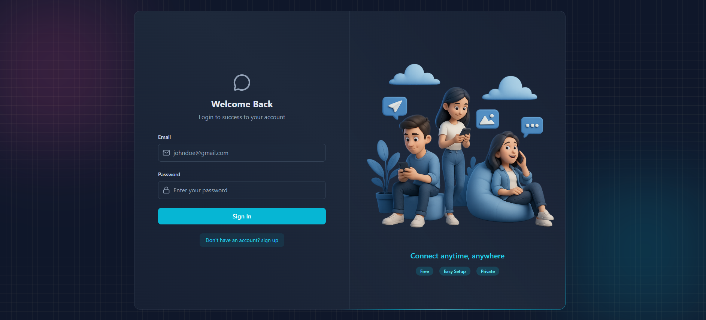
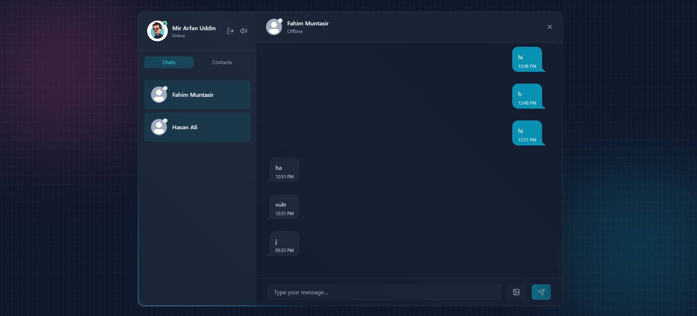

# TalkSphere - Full Stack Real-Time Chat Application

TalkSphere is a production-ready, full-stack real-time chat application built using the MERN ecosystem. It features robust JWT-based authentication, instant messaging powered by WebSockets, advanced cloud-native storage, and comprehensive API security filtering.

<br>

## 🚀 Deployment & Repository Links

- **Demo Video (Screen Recording):** [https://drive.google.com/drive/folders/1_YgK7LY-poikh0JcgfnNeoGn3JwhJi86?usp=sharing]


*   **Live Application:** [talksphere-v2x2.onrender.com](https://talksphere-v2x2.onrender.com/)
*   **Backend API Endpoint:** [talksphere-backend-mpp9.onrender.com](https://talksphere-backend-mpp9.onrender.com/)


<br>

## 📸 App Screenshots

###  Login Page 

  
 
 ### Chat Interface 
  


<br>


## Features

- User authentication with JWT
- Login & signup system using HTTP-only cookies
- Real-time messaging with Socket.io
- Online/offline user status
- Profile picture upload with Cloudinary
- Welcome email after registration using Resend
- Protected API routes with middleware
- Rate limiting & bot protection using Arcjet
- Responsive and clean UI with Tailwind CSS & DaisyUI
- Global state management using Zustand
- Sound notification toggle support


##  Technical Stack
- **Frontend:** React.js, Tailwind CSS, DaisyUI, Zustand, Axios, Socket.io-client
- **Backend:** Node.js, Express.js, Socket.io
- **Database:** MongoDB, Mongoose 
- **Third-Party Integrations:** Cloudinary (Media), Resend API (Email), Arcjet (Security Firewall)

<br>

## API Routes

### Auth Routes (`/api/auth`)

| Method | Route | Description |
|--------|-------|-------------|
| POST | `/signup` | Create a new account |
| POST | `/login` | Login user |
| POST | `/logout` | Logout user |
| PUT | `/update-profile` | Update profile image |
| GET | `/check` | Check authentication status |

### Message Routes (`/api/message`)

| Method | Route | Description |
|--------|-------|-------------|
| GET | `/contacts` | Get all contacts |
| GET | `/chats` | Get chat users |
| GET | `/:id` | Get messages with a user |
| POST | `/send/:id` | Send a message |
<br>

##  Environment Variables Setup

Create a `.env` file inside the root of your `backend` directory and configure the following variables:

```env
PORT=3000
MONGO_URI=your_mongodb_connection_string
JWT_SECRET=your_jwt_secret_key
NODE_ENV=development
CLIENT_URL=http://localhost:5173

RESEND_API_KEY=your_resend_api_key
EMAIL_FROM=your_email_from_address
EMAIL_FROM_NAME=your_email_from_name

CLOUDINARY_CLOUD_NAME=your_cloudinary_name
CLOUDINARY_API_KEY=your_cloudinary_api_key
CLOUDINARY_API_SECRET=your_cloudinary_secret

ARCJET_KEY=your_arcjet_api_key
ARCJET_ENV=development
```


## Backend Server Setup:

```Bash
cd backend
npm install
npm run dev
```
## Frontend Client Setup:

```Bash
cd frontend
npm install
npm run dev
```