# ArikoChats - Application Features Documentation

**Live Application Link:** [https://chat-app-task-rho.vercel.app/](https://chat-app-task-rho.vercel.app/)

ArikoChats is a full-featured, real-time web-based chatting application designed with a focus on modern user experience, speed, and seamless connectivity. Below is a comprehensive list of the features that have been successfully implemented in the application.

---

## 🔐 Authentication & Security

  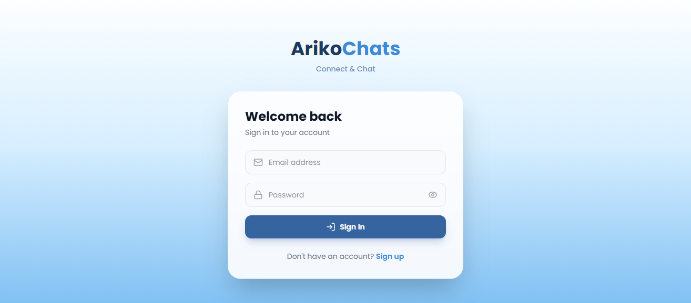

* **User Registration (Sign Up):** New users can create an account using their credentials.
* **User Login:** Existing users can securely log in to access their conversations and data.
* **User Logout:** Securely end the active session with a clean and interactive logout confirmation modal.
* **Protected Routes:** Unauthorized users cannot access chat pages without valid authentication.

## 💬 Real-Time Messaging Capabilities
* **Instant Messaging:** Send and receive messages instantly without reloading the page.

  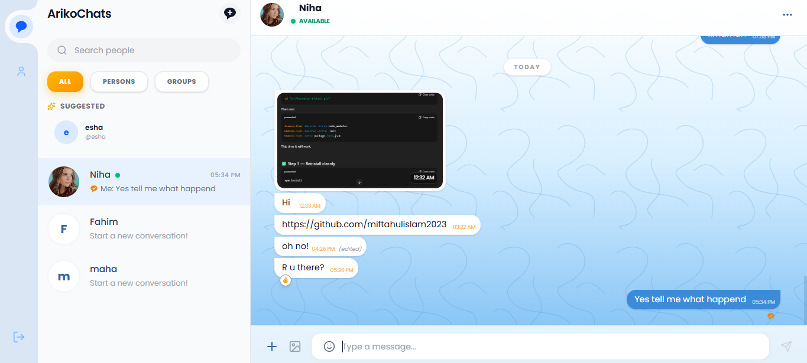

* **Message Status:** Real-time indications for sent and seen messages.

  

* **Unread Messages Indicator:** Visual counters and dividers for unread messages, making it easy to see what you missed.

  

* **Typing Indicator:** Typing indicators for real-time messaging.

  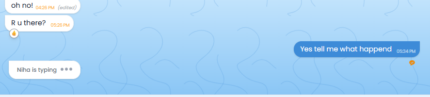

* **Message Reactions:** Users can react to specific messages with various emojis (👍, ❤️, 😂, 😮, 😢, 🙏).

  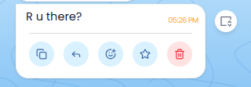

  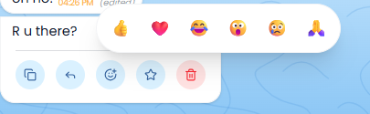

  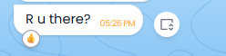

* **Unsend for Everyone:** Users can retract a message they sent, completely removing it from the conversation for both parties.

* **Remove/Delete for Me:** Users can delete messages locally from their own view without affecting the other person's view.

  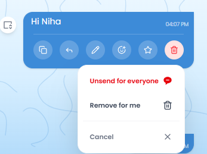

* **Edit message:** Users can edit messages.

  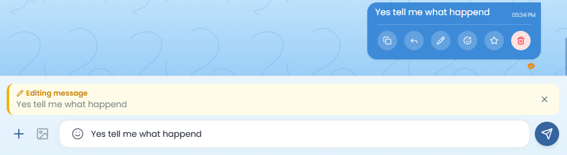

* **Reply to a message:** Users can reply to a specific message.

  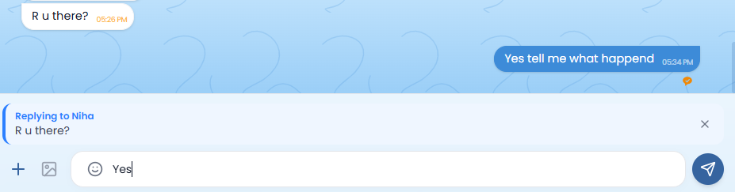

  

## 📁 Media & File Sharing
* **Photo Sharing:** Users can upload and share image files seamlessly in the chat.
* **Document Sharing:** Share various document formats (like PDFs, DOCXs) within the conversation.
* **Shared Media Gallery:** Users can view the information of the person they are chatting with and browse all the photos, links and documents that have been shared in that specific conversation.

  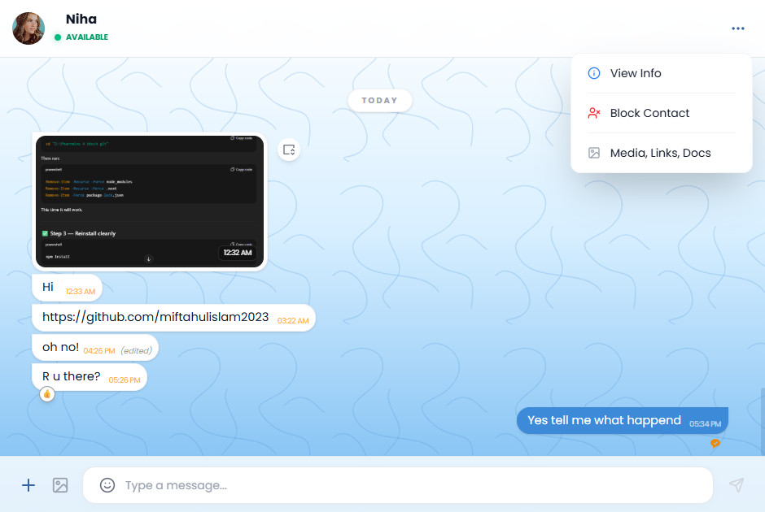

  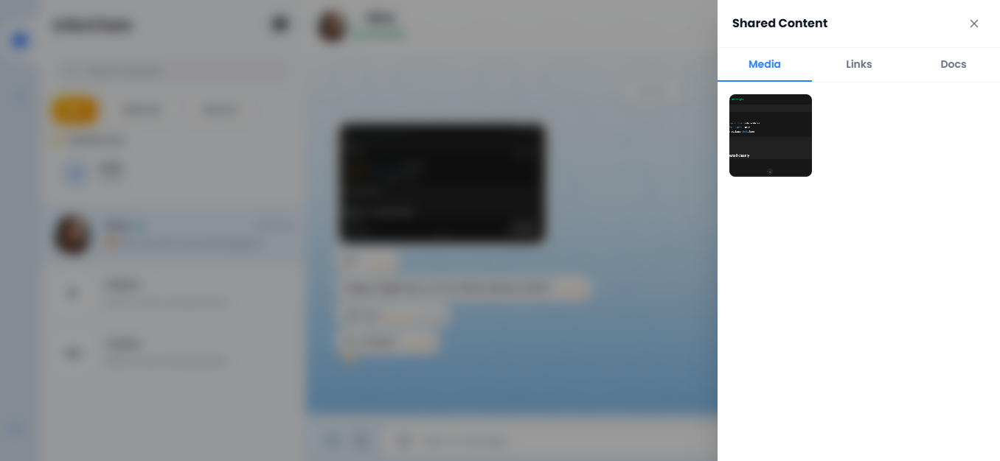

* **Profile Picture Update:** Users can easily update their personal profile avatar.

  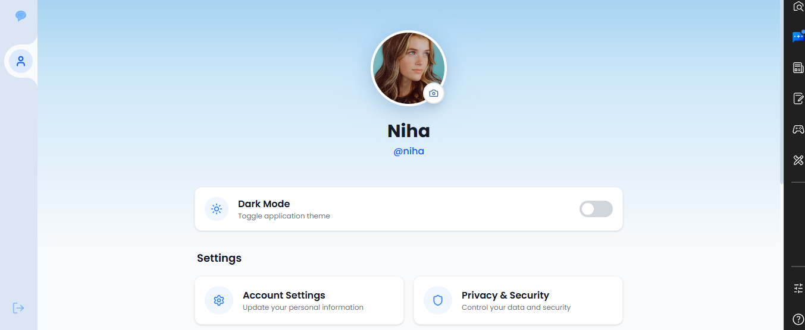

## 👥 User Discovery & Networking
* **Search Users:** Users can search for other people registered on the platform using the global search bar.
* **Suggested Users:** The app automatically suggests available users to start new conversations with.
* **Available Users Display:** Easily browse through a list of people currently available on the platform.

  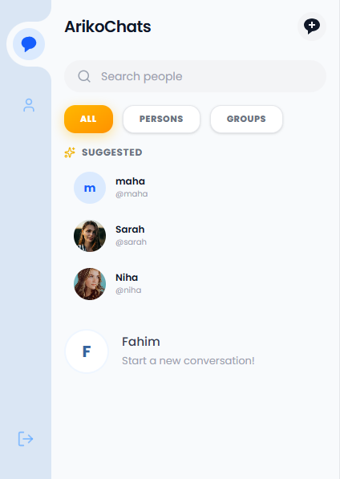

## 🛡️ Privacy & Contact Management
* **Block Contact:** Users have the ability to block unwanted contacts, preventing them from sending further messages.
* **Unblock Contact:** Previously blocked users can be easily unblocked to resume communications.
* **Online Status Masking:** If a user is blocked, their online presence and "last seen" status are completely hidden from the blocked user.

  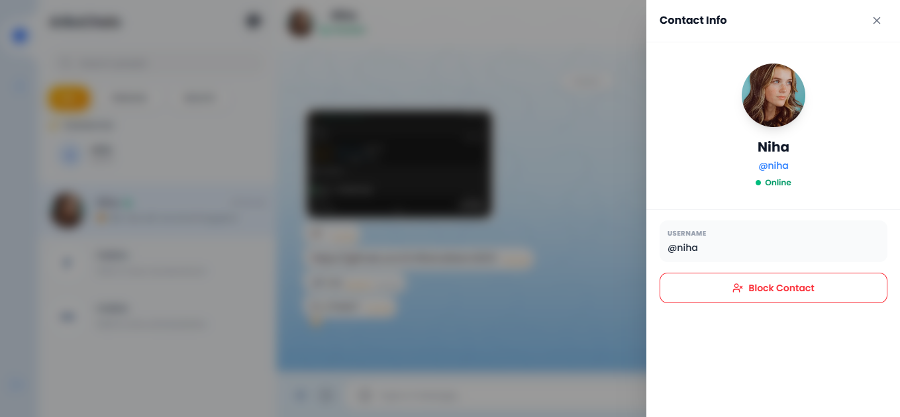

  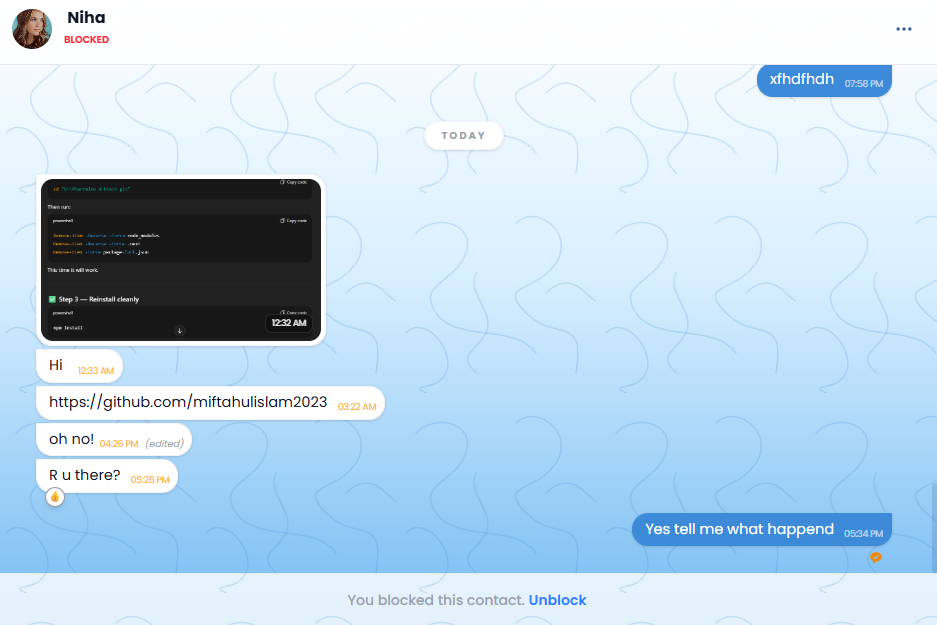

## 🎨 User Interface & Experience (UI/UX)
* **Dark / Light Mode Toggle:** Seamlessly switch between a bright light theme and a sleek dark mode depending on user preference. The preference is automatically saved.

  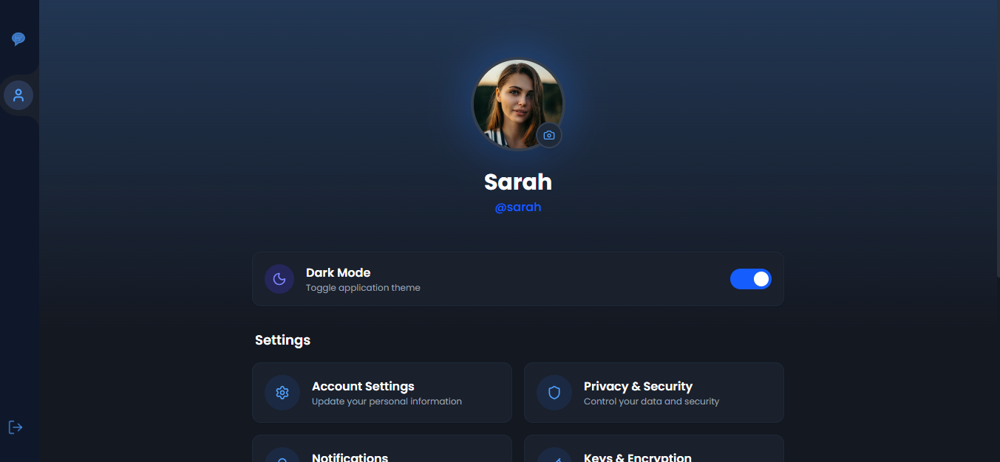

  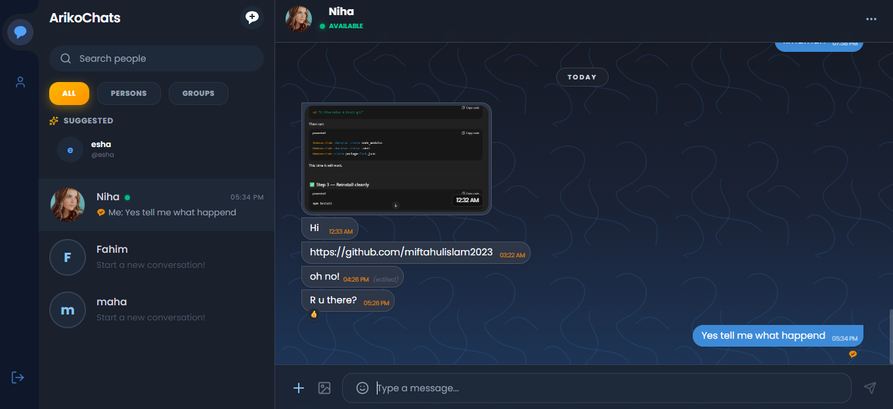

* **Optimized Local Caching:** The application caches previously loaded conversations locally. This ensures that switching between active chats is virtually instantaneous with zero loading delays (WhatsApp-like behavior).
* **Modern Splash Loaders:** Elegant splash screens and inline loaders ensure that users always understand the background loading state of the application.

  

* **Dynamic Popups & Portals:** UI elements like the 'Unsend' menu dynamically adapt to the screen position to ensure they are never cut off or hidden behind other elements.

## 🛠️ Technology Stack & Database
* **Real-Time Engine:** Powered by **Pusher** utilizing **WebSockets** to deliver instant, bidirectional event-driven communication (messaging, typing indicators, reactions, online status).
* **Database:** Powered by **PostgreSQL** hosted on **Neon DB** for highly scalable and reliable data storage.
* **ORM:** **Prisma** is used as the Object-Relational Mapper to seamlessly and securely interact with the database.

## 🚀 Deployment
* **Hosting Platform:** The application is successfully deployed and hosted on **Vercel**, ensuring fast global delivery, high availability, and continuous integration.
